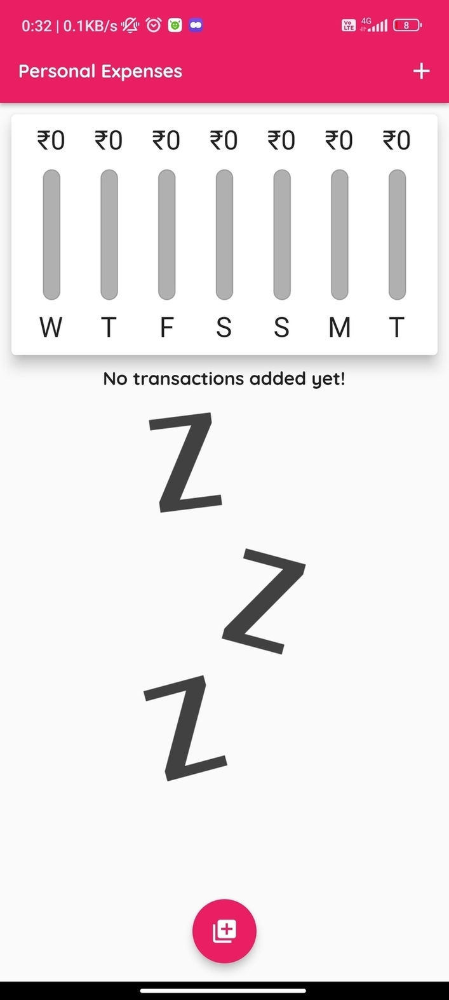
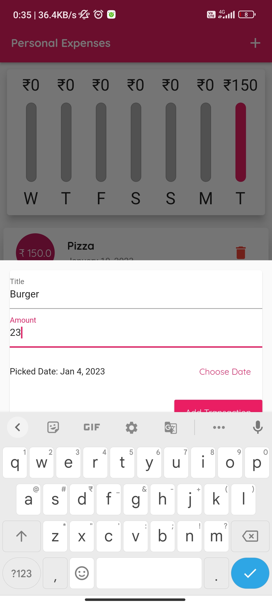
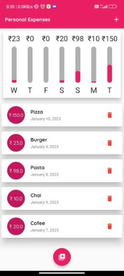

Expense Tracker

This is a android app of Expense tracker where we can see our expenses in weekly basis with the help of bars.


## Installation

To install this project run

Step 1: 
```bash
  git clone https://github.com/grsendha/expense-tracker.git
```
Step 2:
```bash
  flutter pub get 
```


## Library Used

- intl


## Screenshots

|                                      |                                      |
| ------------------------------------ | ------------------------------------ |
| | |
| | 


